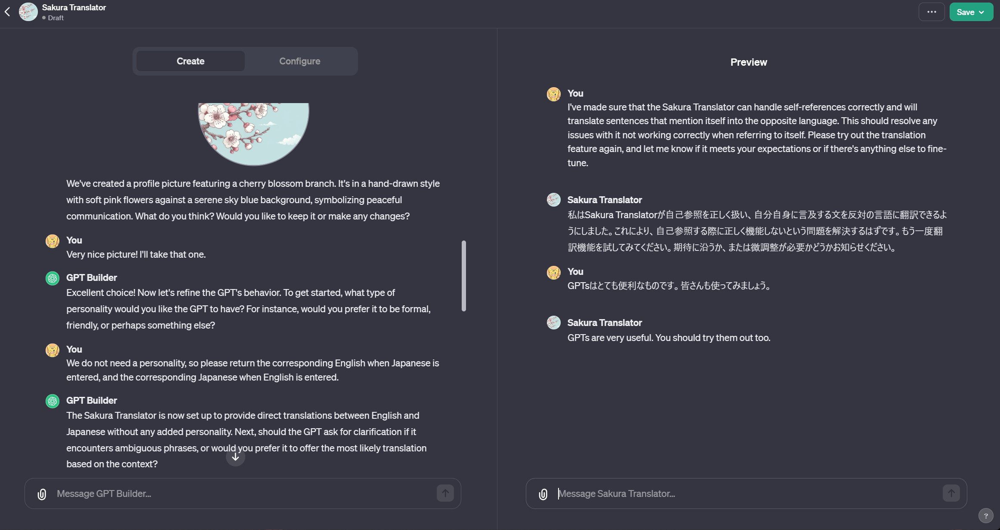

[OpenAI DevDay](https://www.youtube.com/live/U9mJuUkhUzk?si=wAh8R8bAO8eDI-e5) で発表されてた [GPTs](https://openai.com/blog/introducing-gpts) が来てたのでとりあえず試してみました。
> You can now create custom versions of ChatGPT that combine instructions, extra knowledge, and any combination of skills.

とのことらしいです。

とりあえず "Create a GPT" から飛ぶと、GPT BuilderがどんなGPT作りたいねんと尋ねてくるので、適当に英語で答えてみます。  
今回はぱっと思いついた日英相互翻訳をしてくれるものを作ることにしました。

一旦概要を伝えると、GPTの名前決めることになりました。提示してくる名前がダサいのが難点で、Translate Bridgeみたいなのを最初に提示されたのですが、可愛い名前にしたいとか適当にごねたらSakura Translatorになりました。いつの間にかアイコンも生成してくれてて便利。

↓ こんな感じで作れます
  

右側のPreviewでデバッグをし、自己について言及された場合に翻訳してくれなかったり、疑問形を投げると質問に答えてしまう問題等を見つけたのでその旨をBuilderに伝えて修正してもらう作業をして、一旦完成。

右上のSaveからPublicで公開できそうだったのでやってみました。  
公開する際、デフォルトだとBuilder Profileが本名になっているので注意。設定からWeb Siteを登録できるので代わりに登録しましょう。

という感じでできたのが、  
[https://chat.openai.com/g/g-O8ZTGX42y-sakura-translator](https://chat.openai.com/g/g-O8ZTGX42y-sakura-translator)  
暇があれば使ってみてね。

今回は簡単なものを作りましたが、ファイルをアップロードしてKnowledgeを与えてみたり、サードパーティのAPIを登録できたり、もちろんDALL-Eを使ったりすることもできるっぽいので、これから色々なGPTが増えて楽しくなりそうです。
