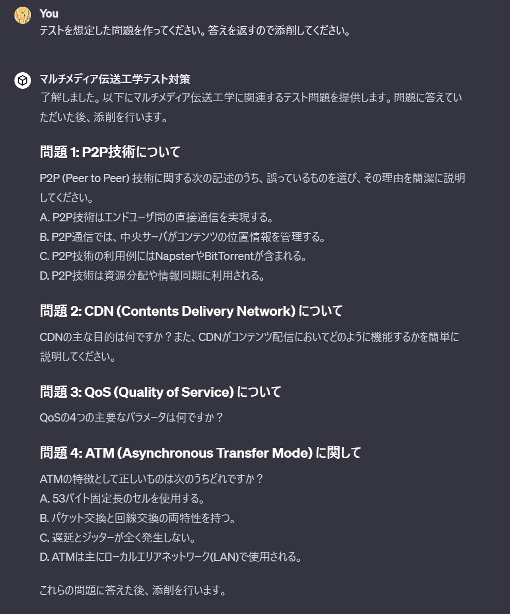

今日 [マルチメディア伝送工学](http://www.ocw.titech.ac.jp/index.php?module=General&action=T0300&JWC=202302059) という授業の期末テストがありました。  
しかし、テスト勉強が苦手な私はどうすればいいかわからず途方に暮れていました。というわけで、今回はそのテスト勉強をChatGPTに丸投げしてみました。

## どうやった？

GPTの作成をしました。作り方は簡単で、Knowledgeに授業資料を全部突っ込むと完成です。授業資料はpdfで、12ファイルあったのですが、どうやら10ファイルが上限だったみたいなのでいくつかを結合した上でアップロードしました。  
あとはよしなにプロンプトを書けば完成です。

では早速予想問題でも作ってもらいましょう

ふむふむ、よさそうですね？  
授業資料を確認したところ、ちゃんと授業スライドに言及されているところから出ていそうです。

答えを確認してみましょう。

問題1の判断基準とかやや怪しいところはありそうですが、概ね良さそうです。問題3なんかは授業スライドそのままでいい感じ。  
というわけで、今後のテスト対策はChatGPTとおしゃべりということで…… (今回はあまり専門的な内容でないのでうまくいってるだけで、**[現状のLLMは嘘をつく](https://www.nri.com/jp/knowledge/glossary/lst/ha/hallucination)ので鵜呑みにしないほうが良いです**)

上記のような感じで、問題を出してもらったり、スライドだけだとわかりにくい概念の説明をしてもらったりしながら、授業内容の復習をしました。  
期末対策はバッチリ！

## オチ

この方法だと授業内容のすべてを網羅できていたわけではなかったので、テストは爆死しました。  
授業で比較的時間かけていないトピックに関する記述問題が出るとは……
