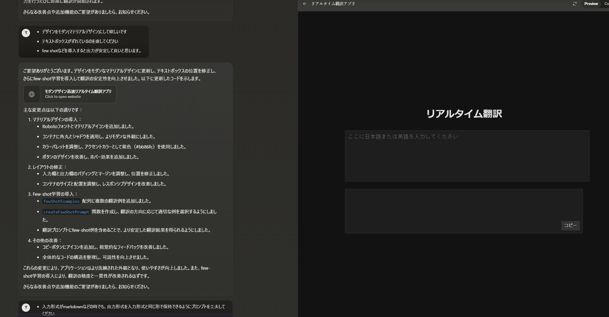
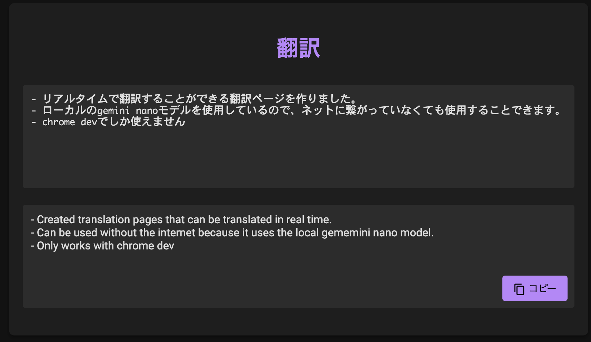

最近仕事のテキストコミュニケーションは英語がメインで、英語が苦手な私は苦しんでいます。

Chrome 126から、LLM(Gemini Nano)がブラウザ上で組み込みで動くらしいので、試しにdeepL的な翻訳ページを作ってみることにします。

詳しい使い方等を知りたい場合は下記リンク先を参照してください。作るにあたって参考にさせていただきました🙏  
[Chrome の 組み込み AI Gemini Nano を試してみる (azukiazusa.dev)](https://azukiazusa.dev/blog/try-chrome-internal-ai-gemini-nano/)

## コードを書く

今回はとりあえず試しに簡単なものを作りたいだけなので、Claude3.5 Sonnetを使って

---

現在chromeでは

```javascript=
const canCreate = await window.ai.canCreateTextSession();

if (canCreate === "no") {
  console.log("Gemini Nano は利用できません");
} else {
  const session = await window.ai.createTextSession();
 
  const result = await session.prompt("こんにちは！");
 
  console.log(result);
}
```

このようなコードで、Gemini NanoというLLMを利用することができます。これを利用して、リアルタイム翻訳サイトを作りたいです。  
ペライチのページで、大きく日本語または英語を入力する入力欄があり、入力の翻訳結果がリアルタイムで大きく表示されるイメージです。コードを書いてください。ダークテーマだと嬉しいです。

---

という感じで雑にプロンプトを書き、htmlを出力してもらいます。適当にデザインや挙動に関して文句をいってフィードバックを行い、改善を行います。  
例えば出力精度を上げるため・出力形式を安定させるためにfew shotを導入してもらったり、デザインをマテリアルデザインっぽくしてもらったりします。


↑ やり取りの様子

そして完成したのが  
[リアルタイム翻訳 (githack.com)](https://gist.githack.com/trasta298/8393b1e42da0fa018c9a014d36bbb92b/raw/a6c279c3f6711f052f1cb96537d122bdfb1ef89b/translate.html)  
です。(2024/07/13現在、準備が完了したchrome devでのみしか動作しません)

こんな感じで動きます
  

ClaudeのArtifactsを初めて真面目に使ったのですが、右側でプレビュー見ながら作業できるのでとても便利でした。今の時代これくらいのもの作るなら一瞬ですね。

## 所感

実際に使ってみると案外使えて面白いです。ちょっと直訳気味なのかな～とは思いますが、私よりは断然英語力あるので問題ないです。  
軽量モデルなのでGPUが載ってるデスクトップで動作が早いのは当然なのですが、M2 Macでも使ってみたところほぼリアルタイム性を失わず翻訳できていたので感動しました。

今回作ったもののメリットとしてやはりオフラインでも動作するというのはいいなと思っていて、今後GAするとこれを使った面白いものが出てくるかもしれません。
