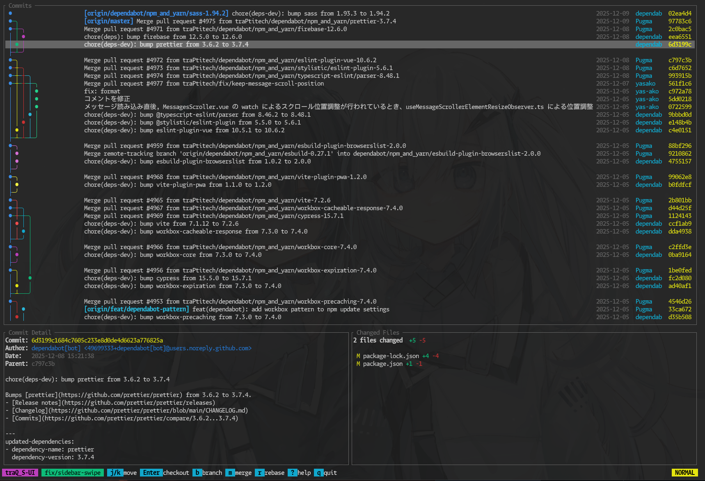
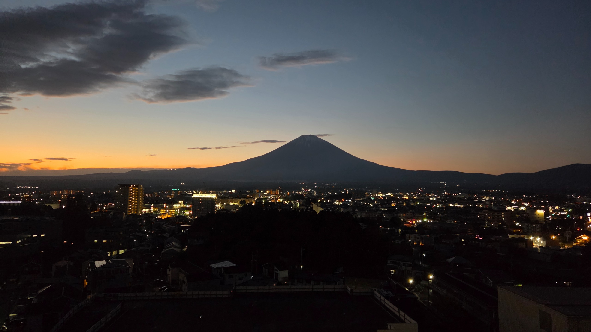

[2024年の振り返り記事](https://trasta.dev/blog/20241230/) では「TreeHacksを頑張る」「面白いプロダクトを作る」の2つをやりたいと言っていました。前者はめちゃ楽しめましたが、後者はちょくちょくは作ったものの思ったよりガッツリとは作れませんでした。来年はもっと色々なものを作っていきたいなと思っています。適当にテーマごとに振り返っていきます。

## 大学

卒業しました！なんだかんだ卒業研究はギリギリクリアすることができ、安心しています。卒研の発表当日にアメリカに行くというなかなかハードなスケジュールでしたが、なんとか無事に単位も取得できました。

大学生という肩書きを失って学割がなくなったのは結構寂しいですね。そろそろ「新卒1年目」という肩書きすら失ってしまうので、本格的に社会人だなという感じです。

<blockquote class="twitter-tweet">
<a href="https://twitter.com/tra_sta/status/1904802088309178681">March 26, 2025</a>
</blockquote>

## 仕事

生活自体はぶっちゃけ学生の時とそんなに変わっていません。元から働いていたので。

去年の振り返りでも触れた「CoeFont通訳」を本格的に開発するフェーズになっていて、今年は色々なところに導入してもらったり、iOS版をリリースしたり、機能を付け加えたりと、充実した開発ができた1年でした。翻訳の精度も着実に向上していて、プロダクトとしての完成度が上がってきています。

一方で、LLMの進化によって1人で捌けるタスクの量が大幅に増えました。もはや2年前とは別の仕事と化している実感があります。コードを書くこと自体はLLMがサポートしてくれるので、むしろデバッグやレビューといった人間が介在する部分がボトルネックになりがちです。どうタスクを効率的に進めるか、日々試行錯誤しています。

CoeFont通訳、今すごく勢いのあるプロダクトなので、優秀なエンジニアの方を募集しています。興味がある人はぜひ一緒にご飯行きましょう！うちの会社に興味がなくても、私自身のやってることとかに興味がある人は個人的に話ができたりすると嬉しいので、気軽に連絡ください！だいたい暇してるので〜

## イベント

今年参加したイベントはそんなになくて、それこそTreeHacksに参加したのが一番大きいです。

### TreeHacks

TreeHacksは参加記を書いたので詳しくはそちらで。

> [英語が喋れない人がスタンフォード大学のハッカソンに参加するとどうなっちゃうの！？ | 東京科学大学デジタル創作同好会traP](https://trap.jp/post/2543/)

全然英語が話せない状態で行ったんですが、本当に楽しめました。友達もできたし、プロダクトも作れたし、スタンフォードは広いし、最高の体験でした。私はもう学生じゃないので今後の参加ができないのが残念なところなのですが、こういうのに興味がある学生の人はとりあえず応募するべきです。話が聞きたいとかあれば全然話すので気軽に連絡ください！

あと全然関係ないけどバズった

<blockquote class="twitter-tweet">
<a href="https://twitter.com/tra_sta/status/1897227050693616067">March 5, 2025</a>
</blockquote>

### traPavilion

traP 10周年を記念したイベント [traPavilion](https://trapavilion.trap.show/) に参加しました。2015年に設立されてから10年、累計部員数2000名を超える団体の節目のイベントということで、後輩が頑張ってくれてすごく豪華なイベントで楽しめました。トークセッションなどもレベルが高く、刺激を受けました。

<blockquote class="twitter-tweet">
<a href="https://twitter.com/tra_sta/status/1977571056912367830">May 10, 2025</a>
</blockquote>

### その他のイベント

Claude Code Meetup Tokyoはぬこぬこさんが主催してくれているイベントで、Claude Codeを使う人たちの話を聞けて学びになりました。他にもLayerXのオフィスで開催されたものなど、AI系ミートアップにいくつか参加しました。

Claude CodeとかAIエージェント系のアップデートが昨今とても速くて、キャッチアップも含めて大変ですが、面白いので色々参加していきたいです。

全体的に私個人のアウトプットが少ないので、来年は色々やっていけたらなと思っています。来年はISUCONがあるらしいので、それは頑張りたいですね。AIエージェントに対する対策とかしてくるのか分かりませんが、どういう出題になるのか楽しみです。私はこういう試験とかコンテストの対策をするのが大の苦手なのですが、さすがに今回はISUCON対策用のAIエージェントとか作ってみようと思ってます。

## 趣味

### Valorant

ついにイモータルに行きました🎉

結局イモータルタッチでかなり冷えてるんですけど、始めた時の目標だったイモータルに行くことができてすごく嬉しかった。

<blockquote class="twitter-tweet">
<a href="https://twitter.com/tra_sta/status/1955612907141804356">February 13, 2025</a>
</blockquote>

去年一回イモータル昇格戦まで行った後に、再チャレンジするまでちょうど1年ぐらいかかりました。ずっとアセンダント2でハードスタックしてて心が折れてたんですけど、なんとかギリギリ行くことができてよかったです。

トータルプレイタイムは2500〜3000時間弱。振り返ればだいぶこのゲームにハマってるなって感じです。

VCJの決勝（Split 2のPlayoff Finals）にも行きました。FENNELを応援してたので負けちゃいましたが、それはそれとして面白かったです。来年も何かしらのValorantのイベントには行きたいですね。

<blockquote class="twitter-tweet">
<a href="https://twitter.com/tra_sta/status/1923942161604804727">May 17, 2025</a>
</blockquote>

## 個人開発

作ったものはいくつかあります。

### 公開したもの

- [Keifu](/blog/20251221/) - Gitのコミットグラフを表示するCLIツール

### 非公開/作りかけ

- 日記管理ソフト - 自分用の日記を管理するソフト
- コードネーム風ボードゲーム - AIをCPUとして参加させて4人集まらなくてもゲームできるやつ

- Alexa風アプリ - 家に余ってたラズパイをディスプレイに繋いで、アニメ調のキャラを表示させて実際におしゃべりしながらツールコールできるやつ（作りかけ）

仕事回りでも細かいアプリは死ぬほど作っていて、LLMがあったらちっちゃいアプリは簡単に作れちゃうので、色々作れて楽しいです。

来年はもっと広く使われるようなやつを作ろうかなと思っています。バズ狙いで行きたい。宣伝と運用頑張りたいなぁ。

catnoseさんの [nani.now](https://nani.now/ja) がかなり流行ってるのを見て刺激を受けてます。翻訳タスク自体はLLMに指示すれば同じことはできると思うんですが、チャットベースだと使い勝手に限界があって、やはり使いやすいUXに落とし込むことで、ツールとしての価値が格段に上がるんだなって感じてます。こういうプロダクトを自分でも作れるようになりたいな〜

## 買い物

なんかめっちゃ買ってる、散財し過ぎかも

### オーディオ関連

- [Audio-Technica AT2035 コンデンサーマイク](https://amzn.asia/d/8QaUF9a) + [YAMAHA AG03MK2 オーディオインターフェース](https://amzn.asia/d/b2vFUV5)
    - 将来的にパソコンを2台体制にすることが見えていて、オーディオ関連機器も簡単に切り替えられるようにしたかったので、オーディオインターフェースに集約しようと考えて買いました。マイクもXLR端子に刺さるように買い替え。今のところ性能に満足しています。

### ガジェット系

- [CIO 柔らかいスパイラルシリコンケーブル CtoC 2m](https://amzn.asia/d/eTZT1EL)
    - マグネット入りケーブル初めて買いましたがとても便利。ピカチュウのAnkerのガジェットポーチを使ってるんですが、くるくる丸めて形状記憶で絡まらないように毎回まとめて入れられるのはすごくいい体験です。
- [Insta360 X5 エッセンシャルキット](https://amzn.asia/d/54WEmq1)
    - 8K対応の360度アクションカメラ。興味本位で買ったところもありましたが、実際すごく面白い。イベントで360度写真が撮れるのが楽しいです。諏訪湖の周りをサイクリングした時に自転車に取り付けて撮影したんですが、普段見れない自分の姿とか撮れて本当に面白かったです。Vlog系の何かを作りたいなと思ってるんだけど、まだ編集がめんどくさくてできていない……
- [Pebblebee スマートタグ](https://amzn.asia/d/gcNHZeM)
    - 今年のベストバイかも。Androidの「探す」ネットワークに対応した充電式スマートタグ。私はけっこうワイヤレスイヤホンを色んな所に忘れちゃうんですが、長野旅行行った時に電車の中に忘れて松本駅に回収されてたのを、タグのおかげで発見→東京駅の忘れ物センターで着払いで送ってもらうことができました。今年2回ぐらいイヤホン無くしてますが、これのおかげで2回とも回収できています。
- [Elgato Stream Deck Neo](https://amzn.asia/d/auWp2Bm)
    - 8個のカスタム可能キー版。正直あんま使いこなしてる気はしなくて、パソコンの起動時間を見るのと、音楽の再生関連のボタンと、Discordのミュートボタン、よく入力する文字列をコピペするぐらい。1万4000円の価値があったかは怪しいですが、Discordのミュートは確かに便利だし、無くて損はないガジェットかも。
- [SwitchBot CO2センサー 温湿度計](https://amzn.asia/d/e9qa4ES)
    - CO2濃度が云々と流行っていたので買ってみましたが、一人暮らしだとそんなにCO2濃度が上がるタイミングってない気がしてます。部屋に複数人いたら確かにすぐ1000ppm超えて換気の目安になって便利でしたが、基本的にはそんな気にすることなく生活しています。今後活躍する場面があるかも？
- [SwitchBot ロボット掃除機 K11＋](https://www.switchbot.jp/products/switchbot-robot-vacuum-cleaner-k11)
    - 掃除機書けるのめんどくさかったので最高。小さいし、一人暮らしのワンルームでも置けて良い。床にものを散らかしたりしないめんどくさがりは買うべき。
- [Even Realities G2 + R2](https://www.evenrealities.com/ja-JP/smart-glasses)
    - 17万円しました。買うのにはかなり勇気が必要でしたが、こういう未来系のガジェットはどんどん試していきたいなと思っています。普段からメガネユーザーなので最悪メガネとして使えるし、損は無いんじゃないかなと考えてます。届いたらレビューしようと思っています。
- [Galaxy S25](https://www.samsung.com/jp/smartphones/galaxy-s25/)
    - すごくいいです。元々Galaxy S20を使ってたので5世代ぶりの乗り換え。本当はGalaxy Z Fold 7が欲しかったんですが26万円するので踏ん切りがつかず、S25なら13万円で済むのでこちらに。手が大きくないのでちっちゃい奴が欲しくて、S25が一番フィットしました。乗り換え前と比べると流石にとにかく電池持ちがいい、他にも細かい部分とか全体的なクオリティが非常に良くて満足しています。
- [HOVEY WORKS ZENT75-HE](https://kibushop.com/products/zent75-he)
    - 今のところ最高。Rainy75のWOBKEYと共同開発らしく、僕が買ってきた歴代キーボードの中で一番打鍵音が好きです。また、Valorantをしてる関係上ラピドリが載っていないキーボードは事実上使えない中、このキーボードは 0.01m のラピッドトリガーに対応していてナイス。また、デザインも好みで、オレンジのハイライトが好きです。安かったのでアリエクで買いました。
- [RTX 4070](https://amzn.asia/d/aljFNhF)
    - 1660 superが4年も現役で限界を迎えていたので買い替え。グラボがめちゃ必要なゲームとかやらないので普通に強くて満足。本当はメモリもりもりGPUほしいのですが、高いし電力消費がヤバいのでコスパ路線。
    - 年末にCPU買い替えようとしたらDDR5の値段が意味わからんことになってて断念。CPUネックがヤバいので来年買い替えたいけど買えるかな～～～
- [Nintendo Switch2](https://www.nintendo.com/jp/switch2/index.html)
    - ポケモンとエアライダーするために買いました。おもろい。

### 生活改善系

- [Wpc. IZA Type:ULTRA LIGHT 男の晴雨兼用傘](https://amzn.asia/d/2YSlfZH)
    - 元々大阪万博に行くとき用に買いましたが、100gを切る重量で重さを感じないので、今もずっとカバンに入れっぱなしにしてる感じで、驚くほど軽くていいです。遮光率100%・UVカット率100%で日傘としても優秀。
- [ace. ガジェタブル ヘザー2 リュック](https://store.ace.jp/shop/c/c40174/)
    - 今使ってるやつが結構大きいカバンだったので、MacBook Airさえ入ればいいなと思って彼女にプレゼントで買ってもらいました。とてもコンパクトで取り回しが良くて気に入っています。仕事とかパソコン必要だけどちょっと出かけるみたいな場面で使っています。
- [タオル研究所 ボリュームリッチ バスタオル](https://amzn.asia/d/3dt4HTJ)
    - 去年ドラム式洗濯機にしたので、バスタオルをもうちょいフワフワしたやつにしたくて買いました。ホテル仕様の厚手ふかふかタイプで、お風呂上がりすごく気持ちよく体拭けています。セールがあったら買い直していきたい。
- [サンワダイレクト フットレスト](https://amzn.asia/d/h0MexPJ)
    - 身長が高くないので、今の机の高さに合わせると足が届かなくて困ってたので購入。低反発クッションタイプで、かなり効果があって早く買っておけばよかった。
- [HUANUO PCモニターアーム デュアル](https://amzn.asia/d/ep98zfo)
    - 元々画面3枚で1枚しか浮かせてなくて2枚は足付き運用でしたが、さすがにダサいなと思って全部画面を浮かせるようにしました。足の部分が空いてスピーカーとか置けるようになったので、やってよかった。
- [Xiaomi デスクトップスピーカー](https://amzn.asia/d/gifmxac)
    - 前は2000円ぐらいの安いスピーカーでしたが、6000円の横長のスピーカーに若干グレードアップ。音質とかに激しいこだわりないので概ね満足なんですが、「ボリュームの小さい音がカットされる現象」があってちょっと気になります。なんとか音量調整してこの現象が起きないように使っている感じ。
- [チラシ お断り マグネット](https://amzn.asia/d/hlLn38N)
    - 東京に来てから感じていたのですが、毎日ポストにすごい量のチラシが入ってるんですよね。全く見ずに捨てているので、その手間を払うのが嫌で買いました。効果は絶大で、ほぼチラシが入らなくなりました。見ずに捨ててる人は買うべきです。デザインも可愛くていい感じ。
- [BAKUNE](https://amzn.asia/d/6Eq5ot5)
    - [uzimaruさん](https://x.com/uzimaru0000) に誕プレで買ってもらいました。効果があるかと言われると、わかりません。ただ、非常に質が高いことには間違いなく、着心地は抜群なので布団の中でも気持ちよく過ごせることは間違いないです。1着だと毎日着れないので、長期使用レビューもやりづらいところではあるのですが、着続けようとは思ってるので感想があれば書きます。

### 旅行用

- [シルクアイマスク](https://amzn.asia/d/3vdJqZN)
    - 800円ぐらいの天然シルク製。サンフランシスコに行く時に飛行機で寝るために買いましたが、これが本当に良い。普段の睡眠から使ってて、アイマスクがあると睡眠の質が上がったような気がします。夜じゃない時間帯に寝ることが多いので、明るい状況でもぐっすり眠れて最高。かなりおすすめ、買うべき。
- [Naturehike 寝袋 封筒型](https://amzn.asia/d/1GjADQx)
    - TreeHacksで使わないといけなくて買いました。建物の中なのでそこまで防寒する必要はなく、超軽量コンパクトなやつを買いましたが結構よかったです。それ以外一回も使ってないですが……
- [IUGGAN キャスターカバー](https://amzn.asia/d/4rycJ8i)
    - キャリーケースに付ける用のシリコン製。車輪のままだとすごくうるさいので買いましたが、驚くほど静かになります。オレンジを買ったので自分のキャリーケースが一発で分かるのも良い。

## 旅行

### ベイエリア (アメリカ)

なんといってもベイエリアですね。TreeHacks（スタンフォード）、ゴールデンゲートブリッジ、山登り、アルカトラズ島、NVIDIAの本社見学、Computer History Museumなど、3週間ぐらい滞在して色々な経験ができました。あとWaymoに乗れたのは良かった。
あとベイエリアのオフィスに缶詰で仕事も進んだ。

<blockquote class="twitter-tweet">
<a href="https://twitter.com/tra_sta/status/1892658035220205920">February 20, 2025</a>
</blockquote>

<blockquote class="twitter-tweet">
<a href="https://twitter.com/tra_sta/status/1893469785406558543">February 23, 2025</a>
</blockquote>

<blockquote class="twitter-tweet">
<a href="https://twitter.com/tra_sta/status/1896862914906300899">March 4, 2025</a>
</blockquote>

### 国内旅行

- 長瀞（埼玉県）: 「小さなホテル セラヴィ」という宿がとても良くて、ぜひもう一回行きたいです。
- 諏訪湖（長野県）: 星空観光列車に乗って星空眺められて楽しかった。スワイチもやりました。ちょうどいい距離で良かった。

<blockquote class="twitter-tweet">
<a href="https://twitter.com/tra_sta/status/1961624186990063858">April 17, 2025</a>
</blockquote>

- 大阪: 大阪万博とヒカルの碁展に行きました。万博はなかなか無いイベントなので結構楽しめました。阪神も優勝したので、阪神とミャクミャクのコラボグッズとかを買ったりしました。ヒカルの碁展は池袋だと人が多すぎて行けなかったので、大阪開催のタイミングで行きました。やっぱ画力が凄くて、圧倒された。ヒカルの碁すごく面白いのでぜひ読んでほしい。地元が近いので、ついでに地元を巡ったりもしました。

<blockquote class="twitter-tweet">
<a href="https://twitter.com/tra_sta/status/1969400320892813823">April 24, 2025</a>
</blockquote>

- 御殿場（会社合宿）: 仕事でしたが、さわやかが近かったので2回行きました。さわやかumai。

去年に比べてあまり旅行行ってない感じですが、来年は卒業旅行でいろいろ行ったりする予定があるので、今年よりも旅行がめちゃ増えそう。来年も旅行色々楽しみたいです。

## 2026

今年は思ってるより色々楽しめて、かつ仕事もいい感じに順調に開発できていると思っています。

- 仕事を今以上に軌道に乗せつつ、グレードアップさせる
- AI Agent・LLMを用いた開発を効率的にできるよう工夫する
- アウトプットを増やす - LLMの力を借りつつ、ブログをちょくちょく出す
- 外に公開できるプロダクトを個人で作る - 今年は小粒のやつをちょくちょく作りましたが、もっと広く使われるようなやつを作りたい
    - 特に対話型のアプリはどういうのがいいのかなとずっとプロトタイプを作り続けているので、ここらで外に出せるものを出したい気持ちがある

もう新卒すら名乗ることができなくなる歳に来年なるので、寂しさと怖さだけを最近感じています。
20代も後半になってしまったので、残りの少ない20代もできるだけ楽しんでいきたいなと思っています。20代は一回しか来ないらしいので。

