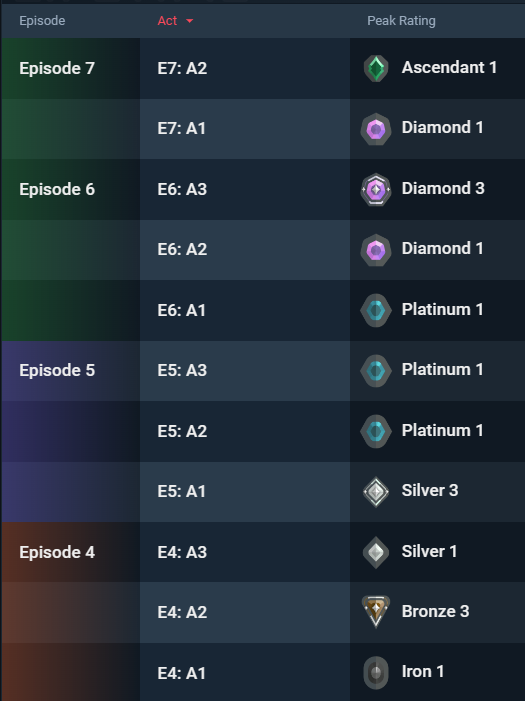
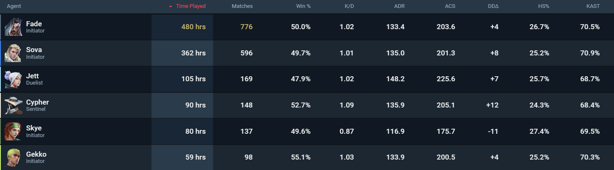

This might be a bit sudden, but there's a site called [AtCoder](https://atcoder.jp/) that hosts competitive programming contests. AtCoder assigns colors to different rating levels, and when players rank up and their color changes, there's a tradition of writing a "color change retrospective" article.
So, since my rank (color) changed in VALORANT, I thought I'd try writing one too. To be honest, this might just be an upswing, so I'm not sure if I can maintain it...

This article is intended for people who have played competitive mode in VALORANT.

## Background

I've been playing VALORANT for about 2 years (since February 2022). I think it was popular among my friends, and there was strong pressure for me to play. It was my first keyboard and mouse FPS game.
My current rank is Ascendant (roughly top 5%), and my rank progression looked something like this. Since it was my first FPS, I naturally started at Iron 1.

I mainly play Initiator, specifically Fade and Sova only.

## Things I Consider to Rank Up

Here's what I've been conscious of while trying to rank up. That said, I'm not really the type to think things through analytically, so this might not be very helpful. (My friends often scold me about my positioning.)
What I'm about to share is common knowledge for high-ranked players.

These strategies assume you're playing Initiator. If you're not very versatile like me, I think it's best to just keep picking the role that suits you.

### Let Others Carry You

This is the most important thing when playing Initiator. My recent match stats show ACS under 200 more often than not, which is quite low.
The reason I still win is because Duelists carry me. Initiator abilities exist to help Duelists get kills. I'm always conscious of sticking close behind Duelists and timing my abilities to help them secure kills.

### Be Conscious of Crosshair Placement

This is one of the most noticeable differences from skilled players. Even if you think you're doing it well, you're probably not. I'm not doing it well either. Compare your gameplay recordings to Laz's videos. The difference is night and day.

When talking about crosshair placement, people often mention headlines and headlines. This is explained in many places so I'll skip the details, but in my case, I try to mimic the perspective of my favorite pro players as much as possible.
For example, I watch Laz's videos and streams and take notes like "this is how you clear this map while peeking from this angle." (Laz's Chamber gameplay involves a lot of careful lurking and clearing, so it's very easy to understand.)

### Be Conscious of How You Peek

This is another significant difference from skilled players.
Walk peeking and diagonal peeking are generally weak in most situations, so I try to minimize them.
It's also important to use different types of peeks appropriately. (Jump peek, wide swing, jiggle peek, etc.)

### Move with Your Teammates

Unless you're absolutely confident that you'll win gunfights against opponents, avoid solo plays. As I mentioned earlier, Initiator abilities are meant to be used for teammates. I always try to position myself where I can support my teammates.

### Avoid Fights You Can't Win

Obviously, there are favorable and unfavorable gunfights. I try to avoid engaging in fights I can't win as much as possible. You should always be conscious of the "wall proximity theory." (To the point where you understand it without thinking about it.)

### Adjust Your Shooting Style Based on Distance

You need to be able to unconsciously switch between tap shooting and spray shooting depending on the distance.
Since this is a game where one headshot ends things, I'm always thinking about how to land shots on the head.

### Catch People Off Guard

Unless you're in high-level competitive matches, the chances of matching against the same person are low.
So I try to actively catch people off guard. I stand in different spots each round, change my playstyle, and vary my ability usage.
Also, right after Fade and Gekko were released, I played them exclusively. Many players can't adapt to new agents, so it might create advantageous situations... or maybe I was just on an upswing at the time.

### Practice Single-Shot Weapons

In VALORANT, pistol rounds are worth two rounds. Also, winning eco rounds obviously increases your win rate significantly.
So being good with Classic/Ghost/Sheriff directly impacts your win rate. I try to stay calm, aim for the head, and avoid rapid firing.

### Increase Your Number of Games

This is ultimately the most important thing. Many of the things I've written here are things you'll naturally learn if you have the will to win and play a ton of competitive matches.
Since your base rank tends to stay up once it rises (debatable), just keep playing comp and hope for an upswing.
I feel like if you play an insane amount of hours while you're young, you can reach Immortal. Not sure though.

### Invest in Your Equipment

A 144Hz display is absolutely better than a 60Hz display. Buy one. My rank went up when I switched. (I was playing on 4K 60Hz until around Silver/Gold.)
People say that using the same gear as pros is a safe bet for peripherals. Since I have small hands, I use the Pulsar X2 Mini. I also used the Lamzu Atlantis Mini, but it didn't fit me well.
Actually, until Platinum, I was using a super heavy mouse called the G304 with a sensitivity of 1600 DPI at 0.35, but I switched mice and lowered my sensitivity (now 800 DPI at 0.32). Obviously, lower sensitivity tends to be more consistent. Depends on the person though.

### Review Your Recordings

I review recordings not really for reflection, but more to maintain motivation.
However, reflection is important. I check enemy positions on the result screen, and I review or think about whether my peeks were good or bad at the end of each round.

In solo queue where communication is often difficult, macro knowledge just needs to be at a minimum level like understanding area control concepts. What's important is gunfights. I think it's crucial to consciously remember how you took each fight and learn it through experience.

### Watch Coaching Videos

What skilled players say is generally correct, so you should listen. They'll teach you things that would take a long time to notice on your own, or things you'd never notice, making it a shortcut to improvement.

### Watch Pro Matches

Just watching gets me motivated to play comp (for me at least).
I even went to watch Masters in person. I got an EDG flag and cheered for EDG. I started practicing with the Operator after Masters.

<blockquote class="twitter-tweet">
もらった <a href="https://t.co/6krrUhj8Wi">pic.twitter.com/6krrUhj8Wi</a>
&mdash; とらすた (@tra_sta) <a href="https://twitter.com/tra_sta/status/1671043884972142592?ref_src=twsrc%5Etfw">June 20, 2023</a></blockquote> 

## Conclusion

I want to reach Immortal...
