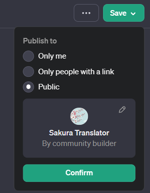

[GPTs](https://openai.com/blog/introducing-gpts), which was announced at [OpenAI DevDay](https://www.youtube.com/live/U9mJuUkhUzk?si=wAh8R8bAO8eDI-e5), has arrived, so I gave it a try.
> You can now create custom versions of ChatGPT that combine instructions, extra knowledge, and any combination of skills.

That's what they said.

When you go to "Create a GPT", GPT Builder asks what kind of GPT you want to create, so I just answered in English.
This time, I decided to make something that does mutual Japanese-English translation, which was the first thing that came to mind.

After explaining the general concept, we moved on to naming the GPT. The downside is that the suggested names are a bit lame. They first suggested something like "Translate Bridge", but after I complained a bit saying I wanted a cute name, it became "Sakura Translator". It also generated an icon for me at some point, which is convenient.

Here's what the conversation looked like:

Using the Preview on the right side for debugging, I found issues like it not translating when asked about itself, and answering questions instead of translating when given interrogative sentences. I reported these issues to the Builder and had them fixed, completing the initial version.

You can publish it publicly from the Save button in the top right.
When making it public, note that the Builder Profile defaults to your real name. If you don't want to reveal your real name, you can register a Website in the settings as an alternative.

And here's what I created:
[https://chat.openai.com/g/g-O8ZTGX42y-sakura-translator](https://chat.openai.com/g/g-O8ZTGX42y-sakura-translator)
Give it a try if you have time.

I made something simple this time, but it seems like you can upload files to give it Knowledge, register third-party APIs, and of course use DALL-E, so it looks like we'll see lots of different GPTs emerging and things will get exciting.
