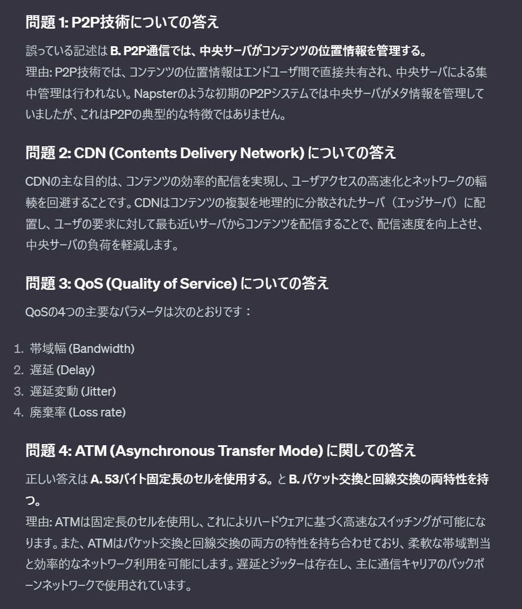

Today I had a final exam for a course called [Multimedia Transmission Engineering](http://www.ocw.titech.ac.jp/index.php?module=General&action=T0300&JWC=202302059).
However, I'm not great at studying for exams and was at a loss for what to do. So this time, I decided to delegate my exam preparation entirely to ChatGPT.

## How Did I Do It?

I created a custom GPT. The process was simple: just upload all the course materials to Knowledge and you're done. The course materials were in PDF format, totaling 12 files. However, it seems there's a limit of 10 files, so I had to merge some of them before uploading.
After that, I just wrote some appropriate prompts and it was complete.

Now let's have it create some practice questions.

Hmm, looks good!
After checking the course materials, the questions seem to be properly based on content mentioned in the lecture slides.

Let's check the answers.

There are some slightly questionable parts, like the criteria for Question 1, but overall it looks good. Question 3 in particular is straight from the lecture slides, which is great.
So from now on, exam preparation means chatting with ChatGPT... (This worked well because the content wasn't too specialized, but **[current LLMs can hallucinate](https://www.nri.com/jp/knowledge/glossary/lst/ha/hallucination), so you shouldn't take everything at face value**)

Following this approach, I reviewed the course content by having it generate questions and explain concepts that were unclear from the slides alone.
Exam preparation complete!

## The Punchline

This method didn't actually cover all the course content, so I bombed the exam.
Who knew there would be a written question about a topic that wasn't covered much in class...
