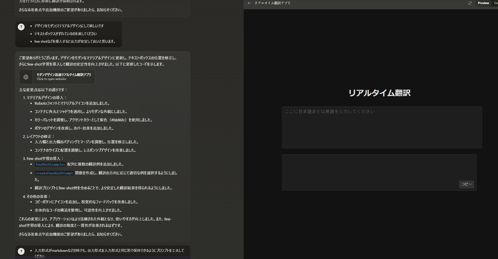
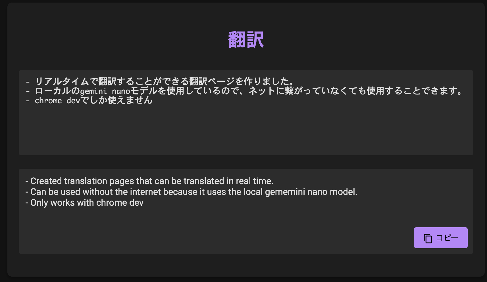

Lately, text communication at work has been mainly in English, and as someone who isn't great with English, I've been struggling.

Starting from Chrome 126, an LLM (Gemini Nano) can run natively in the browser, so I decided to try building a translation page similar to DeepL.

If you want to learn more details, please refer to the link below. I used it as a reference when building this project.
[Try Chrome's Built-in AI Gemini Nano (azukiazusa.dev)](https://azukiazusa.dev/blog/try-chrome-internal-ai-gemini-nano/)

## Writing the Code

This time I just wanted to quickly try building something simple, so I used Claude 3.5 Sonnet with the following prompt:

---

Currently in Chrome, you can use an LLM called Gemini Nano with code like this:

```javascript=
const canCreate = await window.ai.canCreateTextSession();

if (canCreate === "no") {
  console.log("Gemini Nano is not available");
} else {
  const session = await window.ai.createTextSession();

  const result = await session.prompt("Hello!");

  console.log(result);
}
```

I want to use this to create a real-time translation site.
I'm imagining a single-page site with a large input field for entering Japanese or English text, with the translation result displayed in real-time in a large format. Please write the code. I'd prefer a dark theme.

---

That's the rough prompt I wrote, and had it output HTML. I gave casual feedback about the design and behavior, and made improvements.
For example, I had it implement few-shot prompting to improve output accuracy and stabilize the output format, and asked for a Material Design-like appearance.


The interaction process

And here's what I ended up with:
[Real-Time Translation (githack.com)](https://gist.githack.com/trasta298/8393b1e42da0fa018c9a014d36bbb92b/raw/a6c279c3f6711f052f1cb96537d122bdfb1ef89b/translate.html)
(As of 2024/07/13, this only works in Chrome Dev with the proper setup completed)

Here's how it works:


This was my first time seriously using Claude's Artifacts feature, and it was very convenient being able to preview while working on the right side. These days, you can build something like this in no time.

## Impressions

When I actually used it, it turned out to be surprisingly useful and interesting. The translations might be a bit too literal, but it's definitely more proficient in English than I am, so no problem there.
Since it's a lightweight model, it's naturally fast on desktops with GPUs, but I was impressed that when I tried it on an M2 Mac, it was able to translate almost in real-time without losing responsiveness.

One advantage of what I built is that it works offline, which I think is great. Once this goes GA, we might see some interesting applications using this technology.
