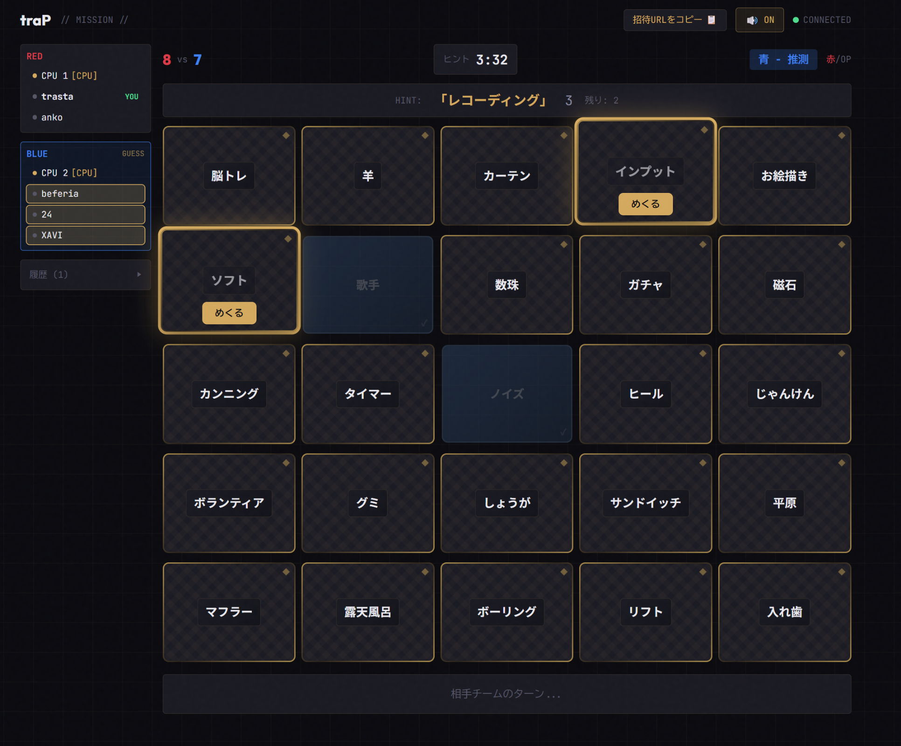

In my [2024 year-in-review post](https://trasta.dev/blog/20241230/), I mentioned two goals: "work hard at TreeHacks" and "create interesting products." I thoroughly enjoyed the former, but while I did create some things here and there, I didn't build as much as I'd hoped for the latter. Next year, I want to create more things. Let me look back at this year by theme.

## University

I graduated! I managed to barely clear my graduation research, which was a relief. It was quite a demanding schedule—I had to fly to America on the same day as my thesis presentation—but I somehow earned my credits.

Losing my student status and the student discounts that come with it is a bit sad. Soon I'll even lose the title of "first-year employee," so I'm really feeling like a full-fledged working adult now.

<blockquote class="twitter-tweet">
<a href="https://twitter.com/tra_sta/status/1904802088309178681">March 26, 2025</a>
</blockquote>

## Work

My daily life honestly hasn't changed much from when I was a student. I was already working before graduation.

The "CoeFont Interpreter" I mentioned in last year's review has entered a serious development phase. This year was fulfilling—we deployed it to various places, released an iOS version, and added new features. Translation accuracy has been steadily improving, and the product is becoming more polished.

On the other hand, the evolution of LLMs has dramatically increased the amount of tasks I can handle alone. It feels like a completely different job compared to two years ago. Since LLMs help with writing code itself, the bottleneck has shifted to parts where humans need to be involved, like debugging and code review. I'm constantly experimenting with how to work more efficiently on tasks.

CoeFont Interpreter is a product with tremendous momentum right now, and we're looking for talented engineers. If you're interested, let's grab a meal together! Even if you're not interested in our company, I'd love to chat if you're curious about what I do personally, so feel free to reach out! I'm usually free~

## Events

I didn't attend many events this year—TreeHacks was definitely the biggest one.

### TreeHacks

I wrote a participation report for TreeHacks, so check that out for details.

> [What Happens When Someone Who Can't Speak English Goes to a Stanford Hackathon!? | Tokyo Tech Digital Creation Club traP](https://trap.jp/post/2543/)

I went there barely able to speak English, but I really enjoyed it. I made friends, built a product, and Stanford's campus is huge—it was an amazing experience. Since I'm no longer a student, I can't participate in the future, which is unfortunate, but if you're a student interested in this kind of thing, you should definitely apply. Feel free to reach out if you want to hear about my experience!

Also, completely unrelated, but this went viral:

<blockquote class="twitter-tweet">
<a href="https://twitter.com/tra_sta/status/1897227050693616067">March 5, 2025</a>
</blockquote>

### traPavilion

I attended [traPavilion](https://trapavilion.trap.show/), an event celebrating traP's 10th anniversary. For a milestone event of an organization with over 2,000 cumulative members since its founding in 2015, my juniors worked hard to make it a spectacular event that I really enjoyed. The talk sessions were high-level and inspiring.

<blockquote class="twitter-tweet">
<a href="https://twitter.com/tra_sta/status/1977571056912367830">May 10, 2025</a>
</blockquote>

### Other Events

Claude Code Meetup Tokyo, organized by Nukonuko-san, was an event where I learned a lot from hearing people talk about using Claude Code. I also attended several AI meetups, including one held at LayerX's office.

Updates to Claude Code and AI agents have been coming at an incredible pace lately, and while keeping up is challenging, it's interesting, so I want to attend various events. Overall, I haven't had much personal output, so I'm hoping to do more next year. I've heard ISUCON will be held next year, so I want to work hard for that. I'm not sure if they'll implement countermeasures against AI agents, but I'm excited to see what kind of problems they'll present. I'm terrible at preparing for tests and contests, but this time I'm thinking of building an AI agent specifically for ISUCON preparation.

## Hobbies

### Valorant

I finally reached Immortal! 🎉

I touched Immortal but then cooled off quite a bit, but I'm really happy I achieved the goal I set when I started playing.

<blockquote class="twitter-tweet">
<a href="https://twitter.com/tra_sta/status/1955612907141804356">February 13, 2025</a>
</blockquote>

It took about a year after reaching the Immortal promotion match once last year to try again. I was hardstuck at Ascendant 2 for so long that my motivation was broken, but I managed to barely make it.

My total playtime is around 2,500-3,000 hours. Looking back, I've really gotten into this game.

I also went to the VCJ finals (Split 2 Playoff Finals). I was cheering for FENNEL, so they lost, but it was still fun. I want to go to some Valorant event next year too.

<blockquote class="twitter-tweet">
<a href="https://twitter.com/tra_sta/status/1923942161604804727">May 17, 2025</a>
</blockquote>

## Personal Projects

I made several things.

### Published

- [Keifu](/blog/20251221/) - A CLI tool for displaying Git commit graphs

### Unpublished/Work in Progress

- Diary management software - Software for managing my personal diary
- Codenames-style board game - A game where AI plays as CPU so you can play without needing 4 people

- Alexa-style app - Connected a spare Raspberry Pi to a display to show an anime-style character you can chat with while making tool calls (work in progress)

I've also been creating tons of small apps for work. With LLMs, small apps are easy to make, so it's fun creating various things.

Next year, I'm thinking of making something that will be more widely used. I want to go for viral. I want to work hard on promotion and operations.

I've been inspired by seeing catnose-san's [nani.now](https://nani.now/ja) become quite popular. While you can do the same translation task by instructing an LLM, chat-based interfaces have limitations in usability, and I really feel that packaging it into an easy-to-use UX dramatically increases the tool's value. I want to be able to make products like this myself~

## Purchases

I bought so much stuff, maybe too much spending...

### Audio-Related

- [Audio-Technica AT2035 Condenser Microphone](https://amzn.asia/d/8QaUF9a) + [YAMAHA AG03MK2 Audio Interface](https://amzn.asia/d/b2vFUV5)
    - I anticipated having a two-computer setup in the future and wanted to easily switch audio equipment, so I decided to consolidate into an audio interface. I also replaced my mic with one that connects via XLR. I'm satisfied with the performance so far.

### Gadgets

- [CIO Soft Spiral Silicone Cable C to C 2m](https://amzn.asia/d/eTZT1EL)
    - This was my first magnetic cable purchase, and it's very convenient. I use a Pikachu Anker gadget pouch, and being able to coil it up with shape memory so it doesn't tangle every time I put it away is a great experience.
- [Insta360 X5 Essential Kit](https://amzn.asia/d/54WEmq1)
    - An 8K 360-degree action camera. I bought it partly out of curiosity, but it's really fascinating. Taking 360-degree photos at events is fun. When I cycled around Lake Suwa and attached it to my bike, I could capture angles of myself I normally can't see, which was really interesting. I want to make some kind of vlog, but I haven't gotten around to editing yet...
- [Pebblebee Smart Tag](https://amzn.asia/d/gcNHZeM)
    - Possibly my best buy of the year. A rechargeable smart tag compatible with Android's "Find" network. I often forget my wireless earbuds in various places, and on a trip to Nagano, I left them on a train and they ended up at Matsumoto Station. Thanks to the tag, I discovered them and had them sent COD from Tokyo Station's lost and found. I've lost my earbuds twice this year, but thanks to this, I recovered them both times.
- [Elgato Stream Deck Neo](https://amzn.asia/d/auWp2Bm)
    - The version with 8 customizable keys. Honestly, I don't feel like I'm using it to its full potential—I mainly use it to check my computer's uptime, music playback controls, a Discord mute button, and copying frequently-typed strings. Whether it was worth 14,000 yen is questionable, but the Discord mute is indeed convenient, and it's a gadget that doesn't hurt to have.
- [SwitchBot CO2 Sensor Thermometer/Hygrometer](https://amzn.asia/d/e9qa4ES)
    - I bought it because CO2 levels were trending, but living alone, I feel like there aren't many moments when CO2 levels rise significantly. It's definitely useful as a ventilation indicator when there are multiple people in the room, quickly exceeding 1000ppm, but basically, I've been living without worrying about it much. Maybe it'll come in handy in the future?
- [SwitchBot Robot Vacuum K11+](https://www.switchbot.jp/products/switchbot-robot-vacuum-cleaner-k11)
    - It was annoying to vacuum manually, so this is great. It's small and fits well even in a one-room apartment for someone living alone. If you're lazy about not scattering things on the floor, you should buy one.
- [Even Realities G2 + R2](https://www.evenrealities.com/ja-JP/smart-glasses)
    - Cost 170,000 yen. It took quite a bit of courage to buy, but I want to keep trying these futuristic gadgets. Since I wear glasses daily, worst case I can just use them as regular glasses, so I figured there's no loss. I plan to review them once they arrive.
- [Galaxy S25](https://www.samsung.com/jp/smartphones/galaxy-s25/)
    - It's really good. I was using a Galaxy S20, so this is my first upgrade in 5 generations. I actually wanted the Galaxy Z Fold 7, but it costs 260,000 yen, so I couldn't commit. The S25 costs 130,000 yen, which was more manageable. I don't have big hands, so I wanted something small, and the S25 fit best. Compared to my previous phone, the battery life is remarkably better, and the overall quality of all the small details is excellent—I'm very satisfied.
- [HOVEY WORKS ZENT75-HE](https://kibushop.com/products/zent75-he)
    - The best so far. It's apparently a collaboration between Rainy75 and WOBKEY, and among all the keyboards I've bought, this has my favorite typing sound. Also, since I play Valorant, keyboards without rapid trigger are essentially unusable, and this keyboard supports 0.01mm rapid trigger, which is great. I also like the design, especially the orange highlights. I bought it on AliExpress because it was cheap.
- [RTX 4070](https://amzn.asia/d/aljFNhF)
    - My 1660 Super was running for 4 years and reached its limits, so I upgraded. I don't play games that require powerful GPUs, so it's comfortably powerful and I'm satisfied. I really want a GPU with lots of memory, but it's expensive and power consumption is crazy, so I went with the cost-performance route.
    - When I tried to upgrade my CPU at year-end, DDR5 prices were insane, so I gave up. The CPU bottleneck is severe, so I want to upgrade next year, but I wonder if I can~
- [Nintendo Switch 2](https://www.nintendo.com/jp/switch2/index.html)
    - Bought it to play Pokemon and Air Rider. It's fun.

### Quality of Life Improvements

- [Wpc. IZA Type:ULTRA LIGHT Men's All-Weather Umbrella](https://amzn.asia/d/2YSlfZH)
    - I originally bought it for the Osaka Expo, but since it weighs under 100g, I don't feel the weight, so I've been keeping it in my bag all the time. It's surprisingly light and great. With 100% light blocking and 100% UV protection, it's also excellent as a parasol.
- [ace. Gadgetable Heather 2 Backpack](https://store.ace.jp/shop/c/c40174/)
    - My current bag is quite large, so I thought I just needed something that could fit a MacBook Air, and my girlfriend bought it for me as a gift. It's very compact and easy to carry, and I like it. I use it when I need my computer but am just going out briefly.
- [Towel Lab Volume Rich Bath Towel](https://amzn.asia/d/3dt4HTJ)
    - Since I got a drum-type washing machine last year, I wanted fluffier bath towels, so I bought these. They're hotel-quality thick and fluffy, making drying off after a bath very comfortable. I want to rebuy them when there's a sale.
- [Sanwa Direct Footrest](https://amzn.asia/d/h0MexPJ)
    - I'm not very tall, so when I adjust to my current desk height, my feet don't reach the floor, which was a problem. This memory foam cushion type is quite effective, and I wish I'd bought it sooner.
- [HUANUO PC Monitor Arm Dual](https://amzn.asia/d/ep98zfo)
    - I originally had 3 monitors with only one mounted and two on stands, but I thought it looked uncool and decided to mount all the screens. With the stand space freed up, I can now place speakers there, so it was worth doing.
- [Xiaomi Desktop Speaker](https://amzn.asia/d/gifmxac)
    - I previously had a cheap speaker that cost about 2,000 yen, but I upgraded slightly to a 6,000 yen horizontal speaker. I don't have strong preferences about sound quality, so I'm generally satisfied, but there's this phenomenon where "quiet sounds get cut off," which bothers me a bit. I'm adjusting the volume to avoid this phenomenon.
- [No Flyers Please Magnet](https://amzn.asia/d/hlLn38N)
    - Since coming to Tokyo, I've noticed an enormous amount of flyers in my mailbox every day. Since I throw them away without looking, I bought this to save that effort. The effect was dramatic—almost no flyers come anymore. If you're throwing them away without looking, you should buy one. The design is cute too.
- [BAKUNE](https://amzn.asia/d/6Eq5ot5)
    - [uzimaru-san](https://x.com/uzimaru0000) bought this for me as a birthday present. Whether it's effective? I can't really tell. However, there's no doubt about the quality—the comfort is excellent, so it's definitely comfortable in bed. Since I only have one, it's hard to do a long-term review, but I plan to keep wearing it and will write my thoughts if I have any.

### Travel Gear

- [Silk Eye Mask](https://amzn.asia/d/3vdJqZN)
    - Natural silk for about 800 yen. I bought it to sleep on the plane when going to San Francisco, and it's really good. I now use it for regular sleep, and it feels like my sleep quality has improved with the eye mask. I often sleep at times other than night, so being able to sleep soundly even when it's bright is great. Highly recommended, you should buy one.
- [Naturehike Sleeping Bag Envelope Type](https://amzn.asia/d/1GjADQx)
    - I had to use it at TreeHacks. Since it was indoors, I didn't need that much warmth, so I bought an ultra-lightweight compact one, which was quite good. I haven't used it once since then though...
- [IUGGAN Caster Cover](https://amzn.asia/d/4rycJ8i)
    - Silicone covers for suitcase wheels. The wheels are super noisy as-is, so I bought these, and they make it surprisingly quiet. I bought orange ones, so I can instantly identify my suitcase, which is also nice.

## Travel

### Bay Area (USA)

The Bay Area, definitely. TreeHacks (Stanford), Golden Gate Bridge, hiking, Alcatraz Island, NVIDIA headquarters tour, Computer History Museum—I stayed for about 3 weeks and had various experiences. Also, getting to ride in a Waymo was great.
I also got a lot of work done cooped up in the Bay Area office.

<blockquote class="twitter-tweet">
<a href="https://twitter.com/tra_sta/status/1892658035220205920">February 20, 2025</a>
</blockquote>

<blockquote class="twitter-tweet">
<a href="https://twitter.com/tra_sta/status/1893469785406558543">February 23, 2025</a>
</blockquote>

<blockquote class="twitter-tweet">
<a href="https://twitter.com/tra_sta/status/1896862914906300899">March 4, 2025</a>
</blockquote>

### Domestic Travel

- Nagatoro (Saitama Prefecture): There's a place called "Small Hotel C'est la vie" that was really nice, and I definitely want to go again.
- Lake Suwa (Nagano Prefecture): Riding the stargazing train and watching the night sky was fun. I also did Suwaichi (cycling around Lake Suwa). It was just the right distance.

<blockquote class="twitter-tweet">
<a href="https://twitter.com/tra_sta/status/1961624186990063858">April 17, 2025</a>
</blockquote>

- Osaka: I went to the Osaka Expo and the Hikaru no Go exhibition. The Expo was a rare event, so I enjoyed it quite a bit. The Hanshin Tigers also won, so I bought Hanshin x Myakumyaku collaboration goods. The Hikaru no Go exhibition was too crowded in Ikebukuro, so I went during the Osaka showing. The artwork is just amazing—I was overwhelmed. Hikaru no Go is really interesting, so please read it. Since it's close to my hometown, I also visited my hometown while I was there.

<blockquote class="twitter-tweet">
<a href="https://twitter.com/tra_sta/status/1969400320892813823">April 24, 2025</a>
</blockquote>

- Gotemba (Company Retreat): It was work, but Sawayaka was nearby, so I went twice. Sawayaka is delicious.

I haven't traveled as much compared to last year, but next year I have plans to go to various places for graduation trips, so travel will increase a lot more than this year. I want to enjoy various travels next year too.

## 2026

I think I enjoyed more things than expected this year, and work development has been going smoothly.

- Get work on an even better track while upgrading
- Find ways to develop more efficiently using AI Agents and LLMs
- Increase output - Write blog posts here and there with the help of LLMs
- Personally create products that can be released publicly - This year I made small things here and there, but I want to make something more widely used
    - Especially for conversational apps, I've been continuously prototyping what would be good, so I feel like it's time to release something externally

Next year I'll reach an age where I can no longer even call myself a new graduate, so lately I've been feeling only sadness and fear.
I've entered the latter half of my 20s, so I want to enjoy the remaining few years of my 20s as much as possible. Apparently your 20s only come once.

