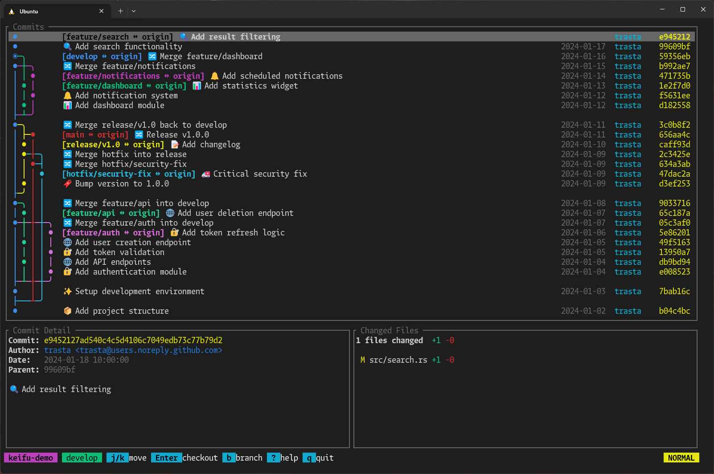

import GitHubRepoCard from '../../../components/GitHubRepoCard.astro'

普段 VS Code の Git Graph 拡張が好きで使っているのですが、最近 CLI にツールを寄せようとしていて、同じようなものが欲しくなりました。探してもしっくりくるものがなかったので、自分で作ることにしました。

## リポジトリ

<GitHubRepoCard
  owner="trasta298"
  repo="keifu"
  description="A TUI tool for visualizing Git branch graphs with interactive navigation"
  language="Rust"
  languageColor="#dea584"
/>

[crates.io](https://crates.io/crates/keifu) に公開しているので、Rust 環境があれば `cargo install keifu` でインストールできます。



## モチベーション

### 既存ツールの検討

CLI で Git のグラフを見れるツールをいくつか試しました。

**LazyGit について**

[LazyGit](https://github.com/jesseduffield/lazygit) は非常に高機能なツールですが、私にとってはオーバースペックでした。普段 Claude Code を使っていて、ブランチの移動以外の `git`/`gh` のコマンドは基本的に全部 Claude にやらせています。そうなると checkout ができれば十分で、リッチな Git 操作の UI は必要ありませんでした。

また、グラフの表示形式のカスタマイズが難しそうでした。公式設定では `branchLogCmd` や `allBranchesLogCmds` でログ出力を調整したり、`showGraph` でグラフ表示の有無を切り替えたりできますが、描画スタイル自体を変更する設定項目は確認した範囲では見当たりませんでした。

**git-graph / git-igitt について**

[git-graph](https://github.com/mlange-42/git-graph) は CLI ツール（ライブラリとしても提供）で、それをインタラクティブな TUI にしたのが [git-igitt](https://github.com/mlange-42/git-igitt) です。git-igitt は閲覧用に特化しており、checkout などの Git 操作は未実装でした。また、UI の矢印があまり好みではありませんでした。Unicode のグラフ描画は意外とこだわりが出るところで、もっと見やすくできるのではないかと思いました。

**serie について**

[serie](https://github.com/lusingander/serie) は一番理想に近いツールでした。ターミナル上で画像プロトコル（iTerm/Kitty）を使ってリッチなグラフを描画するアプローチで、見た目も優れています。

ただ、私は Windows Terminal を使っていて、これらの画像プロトコルに対応していないので使えませんでした。対応ターミナルを使っている人には良い選択肢だと思います。

**gitui について**

[gitui](https://github.com/gitui-org/gitui) も高機能な TUI ですが、グラフ表示機能は [Issue #81](https://github.com/gitui-org/gitui/issues/81) で要望されていてまだ実装されていません。

### 欲しかった機能

どのコミットから分岐しているのか、どんなブランチが生えているのかが一目で分かると便利です。

また、Claude Code でブランチを並列で作業していると、今どんなブランチがあるのか把握しづらくなることがあります。どこのブランチで作業しているかは分かるのですが、全体像が見えなくなりがちです。

## 技術的な話

### 開発について

実装は Claude Code に書いてもらいました。最初は Codex を試しましたが、グラフ描画がうまくいかなかったので Claude Code に切り替えました。

### 技術スタック

参考までに、使っているライブラリは以下の通りです：

- **ratatui** - TUI（ターミナル UI）の描画
- **crossterm** - ターミナル制御
- **git2** - libgit2 の Rust バインディング
- **clap** - コマンドライン引数のパース

グラフの描画ロジックは約 700 行程度で、レーン管理やフォークポイントの検出、色の割り当てなどを行っています。ブランチごとに色分けされていて、なるべく隣り合うレーンで色が被らないようにペナルティベースのアルゴリズムで色を選択しています。

## 使い方

Git リポジトリ内で `keifu` を実行するだけです。

```bash
keifu
```

主な操作：

- `j` / `k` : 上下移動
- `]` / `[` : ブランチラベルのあるコミットへジャンプ
- `Enter` : checkout
- `b` : ブランチ作成
- `d` : ブランチ削除
- `?` : ヘルプ表示
- `q` : 終了

## 対象者

このツールは以下のような人に向いていると思います：

- 普段 Claude Code を使っていて、Git 操作は Claude にやらせている人
- ブランチを並列で作業していて、どんなブランチがあるか分からなくなりがちな人
- どのコミットから分岐しているか、グラフで一目で確認したい人
- LazyGit ほどの機能は要らないけど、ブランチ間の移動は楽にしたい人

## おわりに

今のところ使い心地には満足しています。今後そんなに機能をつけるつもりはありませんが（基本的に Claude Code にやらせているので）、`git worktree` 対応くらいはあってもいいかもしれません。
