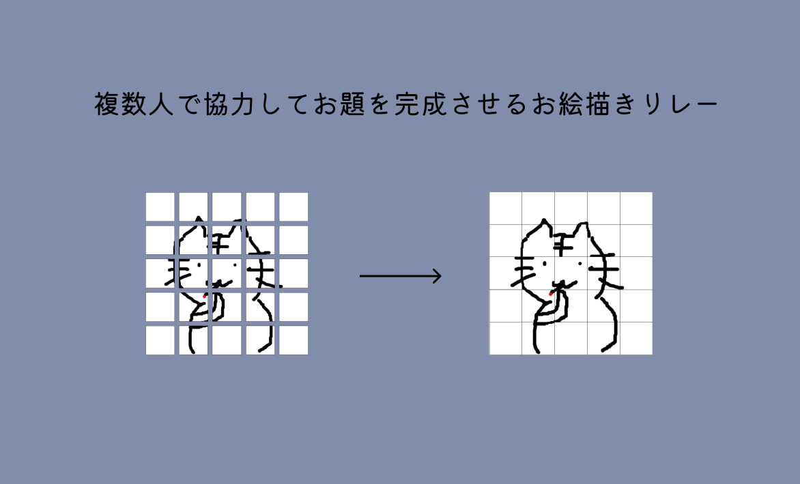

I created a multiplayer drawing relay game that can be played on the web. For more details, please check out the related [blog post](https://trap.jp/post/1467/)!  
I was mainly responsible for the backend implementation.

## Related Links

[Nascalay](https://nascalay.trap.games)  
[Nascalay traP Blog](https://trap.jp/post/1467/)  
[GitHub Frontend](https://github.com/cat-crosswalk/nascalay-frontend)  
[GitHub Backend](https://github.com/cat-crosswalk/nascalay-backend)  
