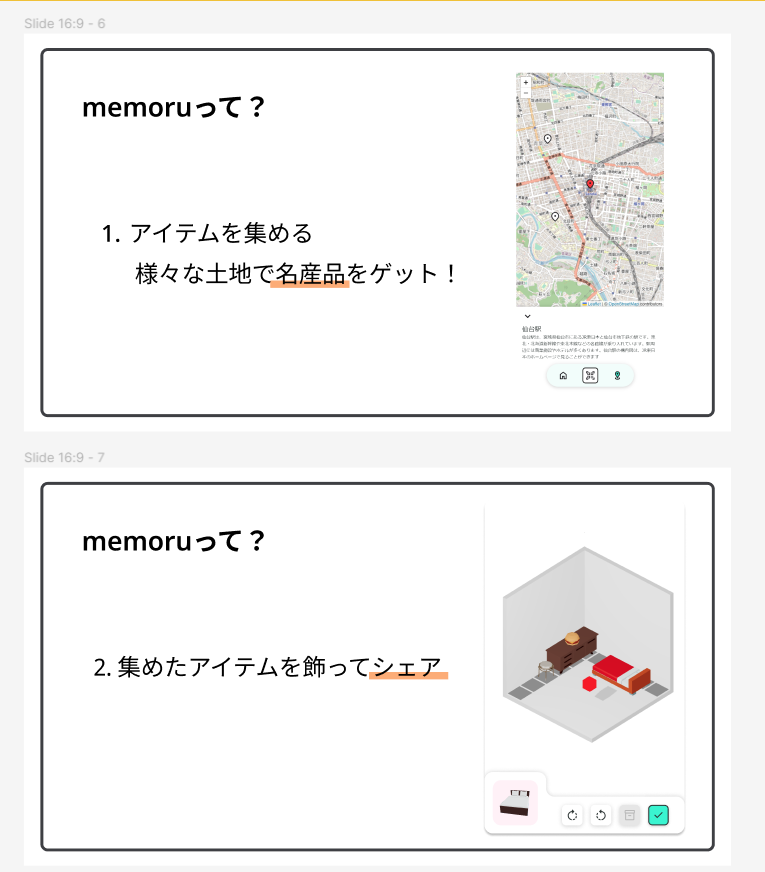

[みやぎハッカソン2023](https://2023.hackathon.miyagi.jp/)において制作したプロダクトです。  
ユーザーはアプリ内で自分だけの部屋を作り、そこに旅先でGETしたアイテムを飾ることができます。

入賞はしませんでしたが、短期間でのハッカソンにおける進め方について様々な反省点を得ることができました。

## 関連リンク

[Demo](https://memoru.trasta.dev)  
[GitHub Frontend](https://github.com/cat-crosswalk/miyagi-UI)  
[GitHub Backend](https://github.com/cat-crosswalk/miyagi)  
