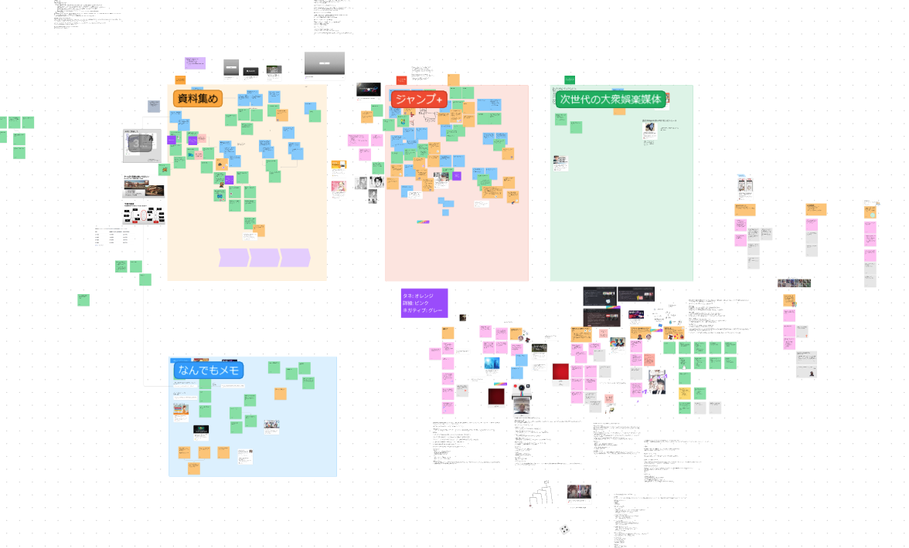

digi-con hackathonにて [@tra_sta](https://twitter.com/tra_sta) [@_SSlime](https://twitter.com/_SSlime) [@ras0q](https://twitter.com/ras0q) [@kamij_i](https://twitter.com/kamij_i) [@toshi00_p](https://twitter.com/toshi00_p) のチームでMikageというアプリケーションの考案をしました。  
Mikageは「マンガ制作の資料集めを手助けしてくれる何か」というテーマのもと考え出されたアプリケーションです。Mikageでは物体を様々な角度から撮影した写真/動画を[3D Gaussian Splatting](https://repo-sam.inria.fr/fungraph/3d-gaussian-splatting/)という技術を用いて3Dモデルに変換し、その閲覧ができます。

↑出題されたテーマに基づいて、FigJam上でアイデアを出し合って議論している様子

## 関連リンク

[Demo](https://mikage.trap.show)  
[X Post](https://twitter.com/tra_sta/status/1707697969833865487)  
[Demo GitHub](https://github.com/cat-crosswalk/mikage-client)
