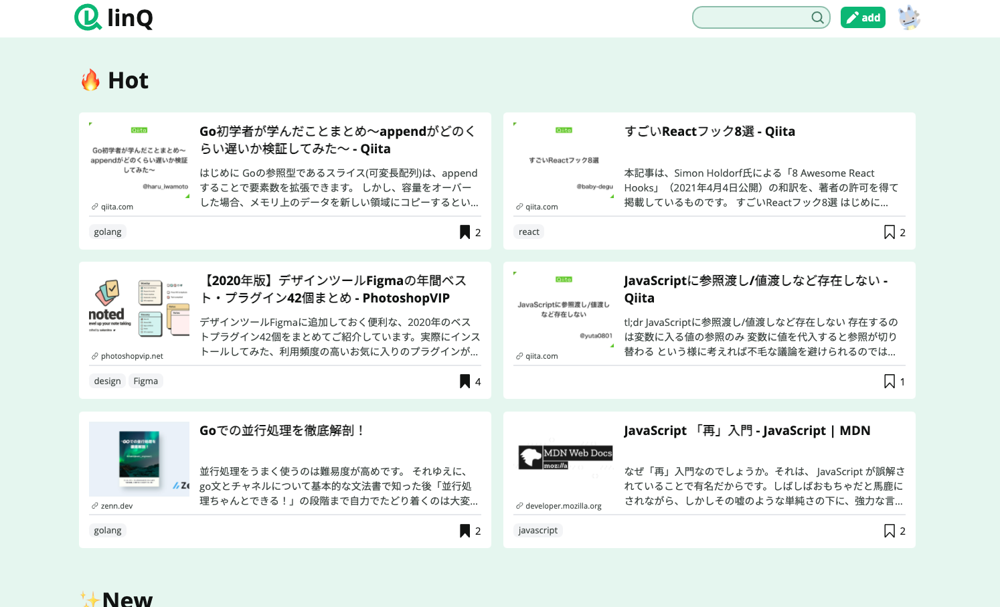

ブックマークサイトで、散らばる便利情報や知識等のサイトリンクをまとめることができます。  
タグ付け・ジャンル分け機能により閲覧したい情報を見つけやすくすることが可能です。

主にTA、フロントエンドの実装を担当し、開発の主導を取りました。詳しくは [ブログ記事](https://trap.jp/post/1321/) をご覧ください👀

## 関連リンク

[linQ traPブログ](https://trap.jp/post/1321/)  
[GitHub Repository](https://github.com/hackathon21spring-05)  
